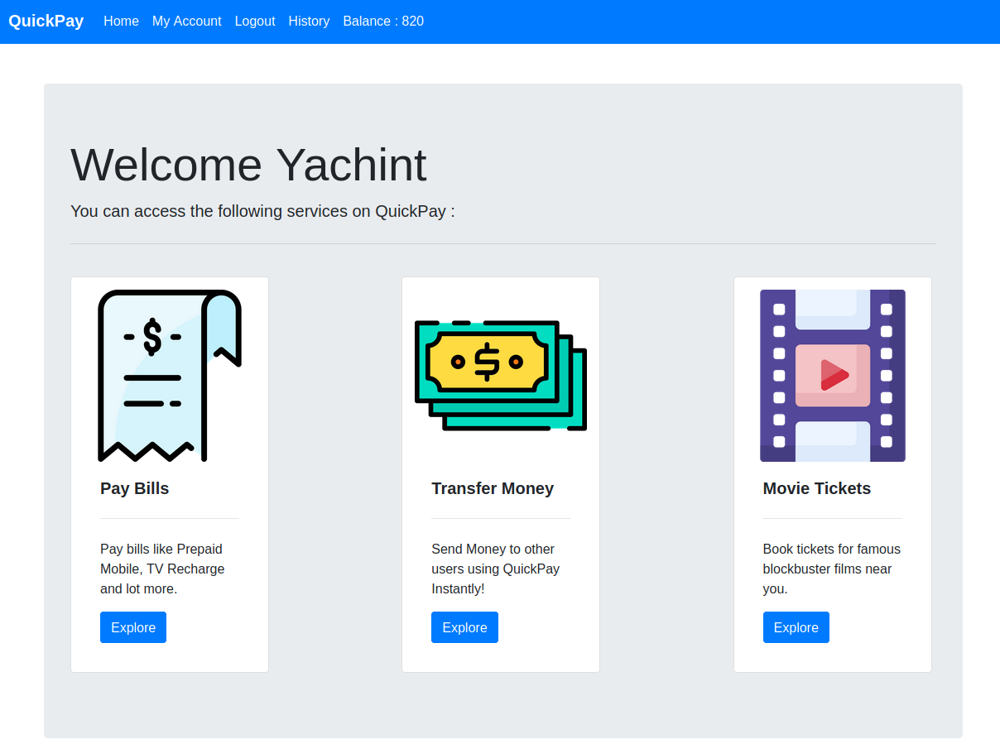
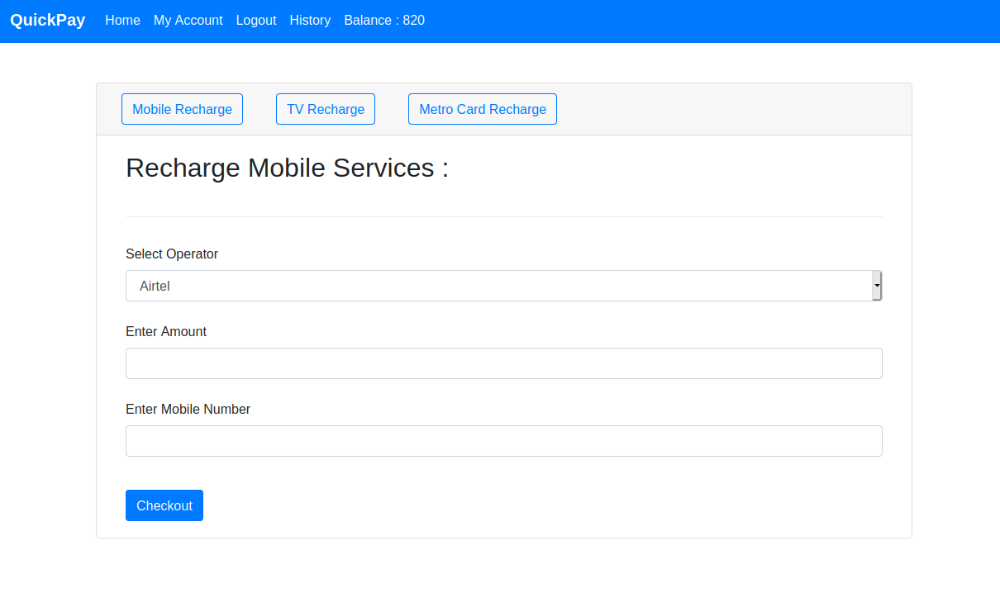
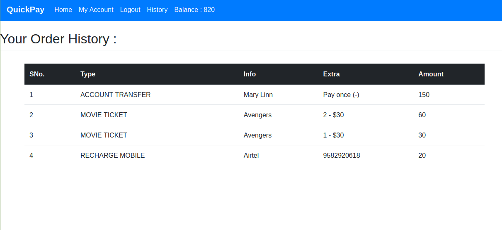
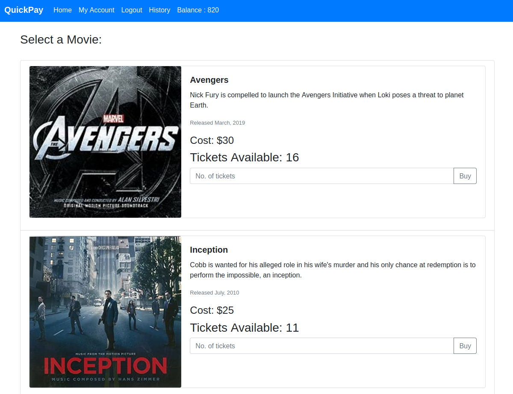

# QuickPay
Payments Portal based on Java Servlets, JSP and MySQL

## Features
* Built using Java Servlets and JSP technologies
* Uses MySQL database to store data
* User-to-User Money Transfer
* Book tickets for your favourite Movies
* Recharge with any operator using QuickPay
* Check History/Log of every transaction
* Experience a rich and fast UI

## Install

After downloading/cloning repository and loading the project in the Eclipse-EE IDE, Run the tomcat server to start the App.

When the Server has launched, visit http://localhost:8080 to launch the App.

## Live Demo

## Screenshots

